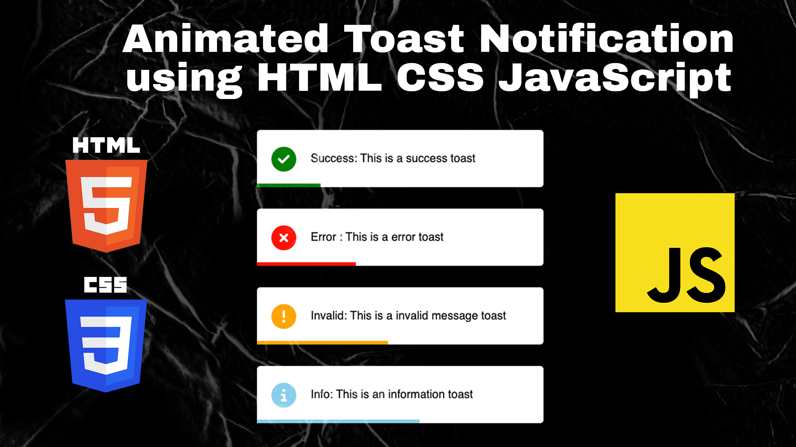

# Animated Toast Notification with Progess Bar Using HTML CSS JavaScript

Elevate user interaction on your web application with an animated toast notification featuring a dynamic progress bar, created using the combined prowess of HTML, CSS, and JavaScript. This engaging feature enables you to provide real-time updates, alerts, or feedback to users in a visually appealing and intuitive manner. By seamlessly integrating the animated toast notification with a progress bar, you can efficiently convey crucial information while enhancing the overall user experience, ensuring that important messages are delivered effectively and with style.

